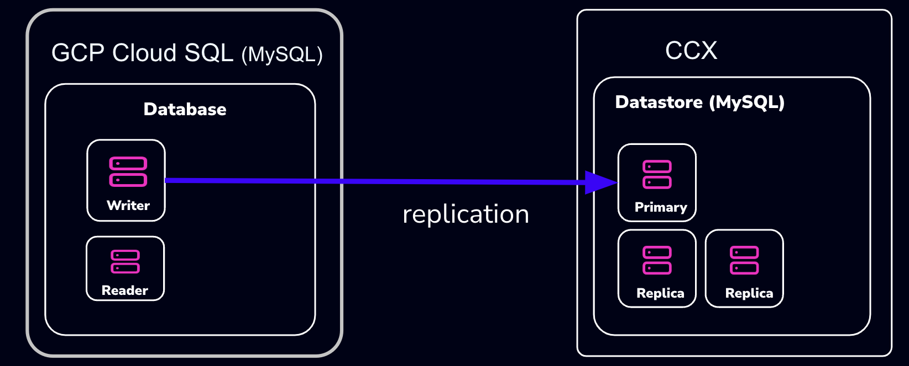

# Importing data from Google Cloud SQL

This procedure describes how to import data from Google Cloud SQL to a MySQL datastore located in CCX.

- The MySQL Datastore on CCX is denoted as the 'CCX Primary'
- The GCP Source of the data is denoted as the 'GCP Primary'



Schematically, what we will setup is this:

:::note
If you dont want to setup replication, then you can chose to only apply the sections:
* Create a database dump file of the GCP Primary.
* Apply the dumpfile on the CCX replica.
:::

## Preparations
* Create a datastore on CCX. Please note that you can also replicate from MySQL 8.0 to MySQL 8.4.
* Get the endpoint of the CCX Primary (under the Nodes section).   . Then endpoint in our case is `db-9bq15.471ed518-8524-4f37-a3b2-136c68ed3aa6.user-ccx.mydbservice.net`.
* The GCP Primary must have a Public IP.
* Get the endpoint of the GCP Primary. In this example, the endpoint is `34.51.xxx.xxx`
* Update the Security group on AWS RDS to allow the IP address of the CCX Primary to connect. To get the IP address of the CCX Primary you do:
        ```
        dig db-9bq15.471ed518-8524-4f37-a3b2-136c68ed3aa6.user-ccx.mydbservice.net
* Ensure you can connect a mysql client to both the CCX Primary and the RDS Writer.        ```

## Create a replication user on the GCP Primary instance
Create a replication user with sufficient privileges on the RDS Writer. 
In the steps below, we will use `repl` and `replpassword` as the credentials when setting up the replica on CCX.

```
CREATE USER 'repl'@'%' IDENTIFIED BY 'replpassword';
GRANT REPLICATION SLAVE ON *.* TO  'repluser'@'%'; #mysql 8.0
GRANT REPLICATION REPLICATION_SLAVE_ADMIN ON *.* TO  'repluser'@'%';
```
### Create the mysqldump 
Be sure to specify the database you wish to replicate. You must omit any system databases. In this example we will dump the databases `prod` and `crm`.
```
mysqldump -uroot -p   -h34.51.xxx.xxx  --databases prod crm  --triggers --routines --events  --set-gtid_purged=OFF --source-data --single-transaction  > dump.sql
```
Wait for it to complete.


## Load the dump on the replica

### Create a replication filter on the replica
The replica filter prevents corruption of the datastore and we are not interested in changes logged by AWS RDS to mysql.rds* tables anyways. Also add other databases that you do not wish to replicae to the filter.
:::note 
If the CCX datastore's system tables are corrupted using replication then the datastore must be recreated.
:::
```
CHANGE REPLICATION FILTER REPLICATE_IGNORE_DB=(mysql, sys, performance_schema);
```

Important! If your database dump contains SPROCs, triggers or events, then you must replace DEFINER:

```
sed 's/\sDEFINER=`[^`]*`@`[^`]*`//g' -i dump.sql
```

### Apply the dumpfile on the CCX Primary:
```
cat dump.sql | mysql -uccxadmin -p -hCCX_PRIMARY
```

## Connect the CCX Primary to the GCP Primary
Issue the following commands on the CCX Primary:
```
CHANGE REPLICATION SOURCE TO SOURCE_HOST='34.51.xxx.xxx', SOURCE_PORT=3306, SOURCE_USER='repl', SOURCE_PASSWORD='replpassword', SOURCE_SSL=1;
```

### Start the replica
On the CCX Primary do:
```
START REPLICA;
```
followed by:
```
SHOW REPLICA STATUS;
```
And verify that:
```
             Replica_IO_State: Waiting for source to send event
	     ..
  	     Replica_IO_Running: Yes
             Replica_SQL_Running: Yes
```	     
### When the migration is ready
```
STOP REPLICA;
RESET REPLICA ALL;
CHANGE REPLICATION FILTER REPLICATE_IGNORE_DB=();
```

### Troubleshooting
If the replication fails to start then verify:
* All the steps above has been followed.
* Ensure that the IP address of the  CCX Primary is added to the security group used by the GCP Primary instance.
* Ensure that you have the correct IP/FQDN of the GCP Primary instance.
* Ensure that users are created correctly and using the correct password.
* Ensure that the dump is fresh.


